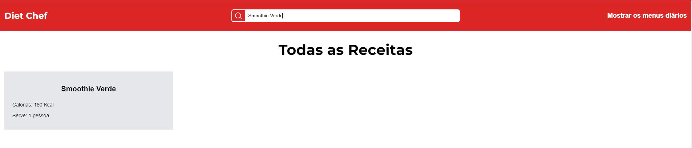

# Diet Chef

<div>
    
    
    
    
    
    
</div>

## Sobre

O **Diet Chef** é uma aplicação web front-end desenvolvida com **React.js** para ajudar os usuários a organizar e gerenciar suas receitas e suas refeições diárias. Ela utilizada uma API que busca os dados da base de dados, trazendo informações relevantes para serem utilizadas posteriormente. Link da API: [DietChefAPI](https://github.com/guilhermevnbraga/DietChefAPI)

## Tecnologias Utilizadas

| Node.js                                                                                                      | React                                                                                                      | Vite                                                                                                     | Git                                                                                                      |
| ------------------------------------------------------------------------------------------------------------ | ---------------------------------------------------------------------------------------------------------- | -------------------------------------------------------------------------------------------------------- | -------------------------------------------------------------------------------------------------------- |
| <a href="https://skillicons.dev"></a> <br> Versão 20.11.1 | <a href="https://skillicons.dev"></a> <br> Versão 18.3.1 | <a href="https://skillicons.dev"></a> <br> Versão 5.4.1 | <a href="https://skillicons.dev"></a> <br> Versão 2.43.0 |

## Requisitos e Como Rodar a Aplicação Localmente

### Pré-requisitos

-   **Node.js** instalado

### Passos para Configuração

1. Faça o clone desse repositório e do repositório da API

2. Instale as dependências do projeto:

    ```bash
    npm install
    ```

    Execute este comando tanto na pasta raiz desse projeto e da API.

3. Rode a aplicação:
    ```bash
    npm start
    ```
    Execute este comando na pasta raiz do projeto e da API.

## Mídia do projeto

### Receitas


### Mais informações sobre as receitas


### Pesquisar receita



### Receita não existente na pesquisa


### Informações Úteis sobre as receitas


### Menu


### Pesquisar Dia


### Dia não existente


### Informações úteis sobre os dias


